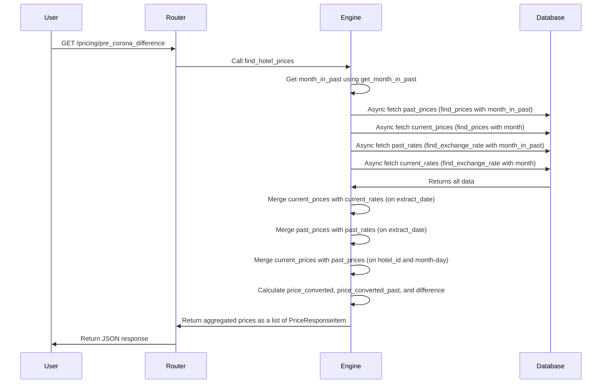

# Experienced Backend Engineer - Technical Interview @ Lighthouse

## 1. Sequence Diagram

```mermaid
sequenceDiagram
    participant User
    participant Router
    participant Engine
    participant Database
    
    User->>Router: GET /pricing/pre_corona_difference
    Router->>Engine: Call find_hotel_prices
    Engine->>Engine: Get month_in_past using get_month_in_past
    Engine->>Database: Async fetch past_prices (find_prices with month_in_past)
    Engine->>Database: Async fetch current_prices (find_prices with month)
    Engine->>Database: Async fetch past_rates (find_exchange_rate with month_in_past)
    Engine->>Database: Async fetch current_rates (find_exchange_rate with month)
    Database->>Engine: Returns all data
    Engine->>Engine: Merge current_prices with current_rates (on extract_date)
    Engine->>Engine: Merge past_prices with past_rates (on extract_date)
    Engine->>Engine: Merge current_prices with past_prices (on hotel_id and month-day)
    Engine->>Engine: Calculate price_converted, price_converted_past, and difference
    Engine->>Router: Return aggregated prices as a list of PriceResponseItem
    Router->>User: Return JSON response
```