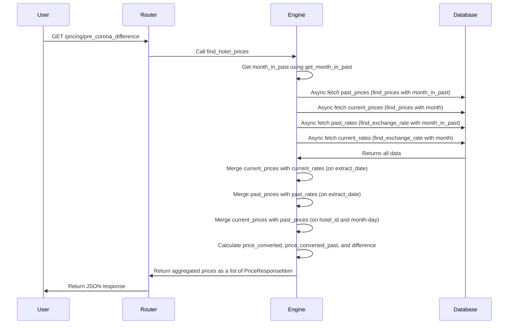

# Experienced Backend Engineer - Technical Interview @ Lighthouse

## 1. Sequence Diagram
The sequence diagram below illustrates the flow of the API request to the `pre_corona_difference` endpoint. It shows how the request is processed through various components, including the router, engine, and database.


## 2. Run the Code
```bash
# 1. Clone the repository
git clone git@github.com:ttabwol-git/lh.git

# 2. Install dependencies
cd lh
python3 -m venv .venv
source .venv/bin/activate
pip install -r requirements.txt
deactivate; source .venv/bin/activate

# 3. Run the application
uvicorn main:app --log-level critical
```

## 3. API Example Request
```bash
curl --location 'http://localhost:8000/pricing/pre_corona_difference' \
  --get \
  --data-urlencode "month=2024-11" \
  --data-urlencode "currency=EUR" \
  --data-urlencode "hotels=1" \
  --data-urlencode "hotels=2" \
  --data-urlencode "hotels=3" \
  --data-urlencode "years_ago=1" \
  --data-urlencode "cancellable=true"

```

## 4. Notes

- Both the key-value store and the SQL database are stored in `data/sqldb.db`, tables `prices`and `rates`.
- The data has been randomized and goes back to 2023-01-01.
- Use `2024-01 <= month <= 2025-04` for the current month to get results.
- Use `currency` with value `EUR`, `JPY`, or `GBP` to get results.
- All mocked pricing data is stored in `USD`.
- Use `hotels` with value between 1 and 5 to get results.
- Make sure `month - years_ago` is greater than or equal to `2023-01` to get results.
- Use `cancellable` with value `true` to get results. All records in database are cancellable.
- This is a mockup and not a production-ready code.
- There isn't proper error handling in the code for the sake of simplicity.
- There isn't unit testing in the code for the sake of simplicity.